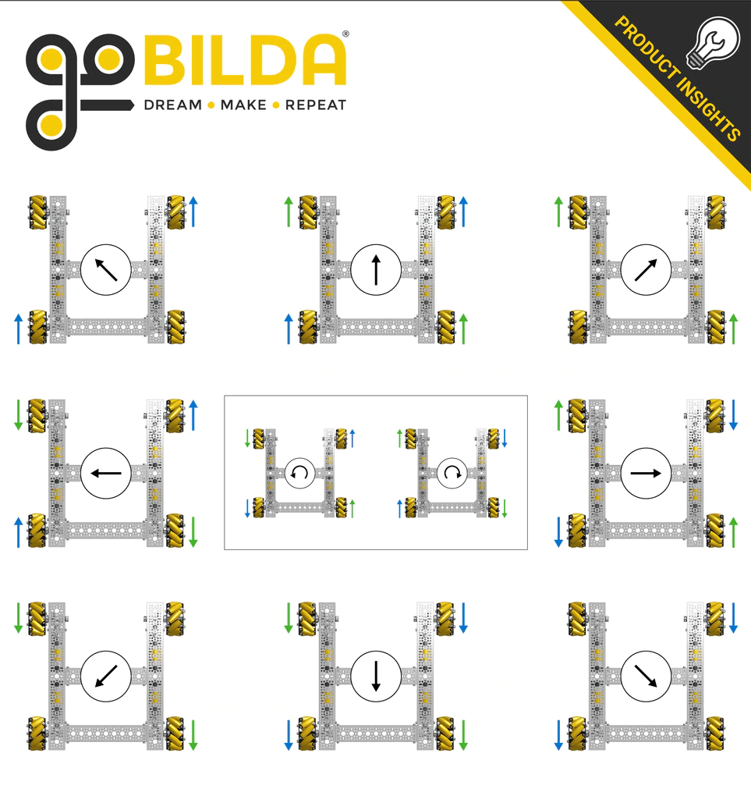

# Mecanum Kinematics

```admonish abstract
The information below is a general overview of mecanum kinematics.
Adapted from the Game Manual 0 page linked at the bottom of this article.
```

Mecanum wheels are a type of wheel that allows for omnidirectional movement. 
They are commonly used in FTC robots because they allow the robot to move in any direction without turning the robot itself.

The image below shows what directions the wheels will move the robot when they are powered in a certain direction.


Notice how the rollers on the wheels make an "X" pattern when viewed from above.
If this pattern is not present, the wheels are placed incorrectly and will not move the robot as expected.

To calculate the power that needs to be sent to each wheel to move the robot in a certain direction, we can use the following formulas:

- `v_x` is the robot's x (forward) velocity
- `v_y` is the robot's y (sideways) velocity
- `w` is the robot's angular velocity (positive is clockwise)

The power for each wheel is calculated as follows:
- Front left wheel: `v_x + v_y + w`
- Front right wheel: `v_x - v_y + w`
- Back left wheel: `v_x - v_y - w`
- Back right wheel: `v_x + v_y - w`

These formulas can be used to calculate the power for each wheel to move the robot in a certain direction 
if you have an intended x, y, and angular velocity.

```java
public double[] calculatePowers(double vx, double vy, double w) {
    double[] powers = new double[4];
    powers[0] = (vx + vy + w); // Front left wheel
    powers[1] = (vx - vy + w); // Front right wheel
    powers[2] = (vx - vy - w); // Back left wheel
    powers[3] (vx + vy - w); // Back right wheel
    return powers;
}
```

## References
1. [Game Manual 0](https://gm0.org/en/latest/docs/software/tutorials/mecanum-drive.html)

