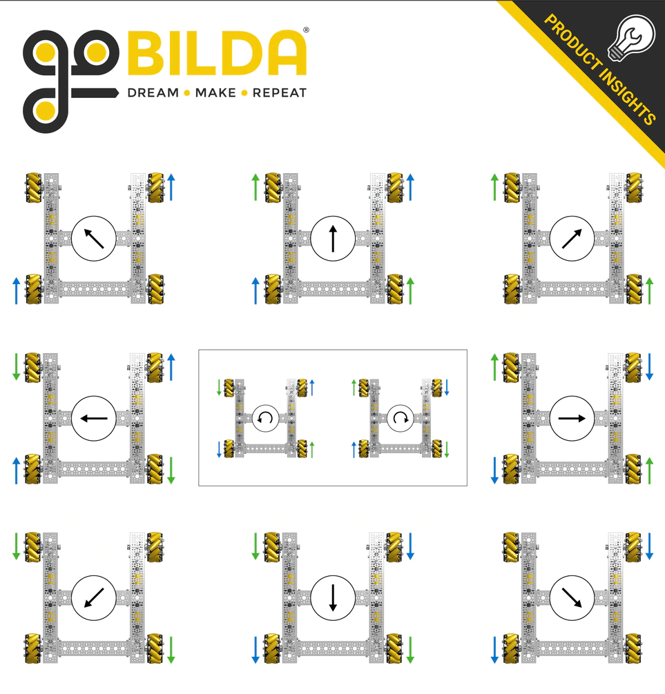

# Mecanum Kinematics

```admonish abstract
The information below is a general overview of mecanum kinematics.
Adapted from the Game Manual 0 page linked at the bottom of this article.
```

Mecanum wheels are a type of wheel that allows for omnidirectional movement. 
They are commonly used in FTC robots because they allow the robot to move in any direction without turning the robot itself.

The image below shows what directions the wheels will move the robot when they are powered in a certain direction.


Notice how the rollers on the wheels make an "X" pattern when viewed from above.
If this pattern is not present, the wheels are placed incorrectly and will not move the robot as expected.

To calculate the power that needs to be sent to each wheel to move the robot in a certain direction, we can use the following formulas:

- `v_x` is the robot's x (forward) velocity
- `v_y` is the robot's y (sideways) velocity
- `w` is the robot's angular velocity (positive is clockwise)

The power for each wheel is calculated as follows:
- Front left wheel: `v_x + v_y + w`
- Front right wheel: `v_x - v_y + w`
- Back left wheel: `v_x - v_y - w`
- Back right wheel: `v_x + v_y - w`

## Using This in TeleOp

In TeleOp, you can use the gamepad joysticks to control the robot's movement.
You can use the left joystick to control the robot's x and y velocity and the right joystick to control the robot's angular velocity.

Here is an example of how you can calculate the wheel powers in a TeleOp program:

```java
public class MecanumTeleOp extends OpMode {
    private DcMotorEx frontLeft, frontRight, backLeft, backRight;

    @Override
    public void init() {
        frontLeft = hardwareMap.get(DcMotorEx.class, "frontLeft");
        frontRight = hardwareMap.get(DcMotorEx.class, "frontRight");
        backLeft = hardwareMap.get(DcMotorEx.class, "backLeft");
        backRight = hardwareMap.get(DcMotorEx.class, "backRight");
    }

    @Override
    public void loop() {
        double v_x = -gamepad1.left_stick_y;
        double v_y = gamepad1.left_stick_x;
        double w = gamepad1.right_stick_x;

        double frontLeftPower = v_x + v_y + w;
        double frontRightPower = v_x - v_y + w;
        double backLeftPower = v_x - v_y - w;
        double backRightPower = v_x + v_y - w;

        frontLeft.setPower(frontLeftPower);
        frontRight.setPower(frontRightPower);
        backLeft.setPower(backLeftPower);
        backRight.setPower(backRightPower);
    }
}
```

## References
1. [Game Manual 0](https://gm0.org/en/latest/docs/software/tutorials/mecanum-drive.html)

